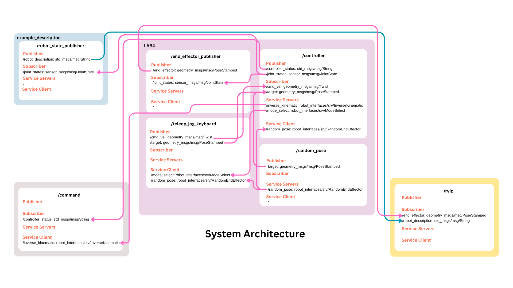

# LAB4 – 3R Robotic Arm Control System

A ROS2 control system for a 3-DOF robotic arm featuring inverse kinematics, teleoperation, autonomous random motion, and real-time Jacobian control.





## 1. Overview

This project implements a complete robotic control architecture with four operating modes:

* **IDLE** – standby
* **IPK** – move robot to target position via inverse kinematics
* **TO** – teleoperation with Cartesian velocity control
* **AM** – autonomous continuous random movement

Includes forward/inverse kinematics, Jacobians, workspace checks, singularity detection, and a custom keyboard teleop interface.

---

## 2. Features

* Real-time motion controller (50 Hz)
* Jacobian-based velocity mapping
* Supports world-frame & EE-frame control
* Smooth joint interpolation
* SVD-based singularity avoidance
* Workspace & joint limit enforcement
* Autonomous random targets
* Keyboard teleop (WASD + QE)

---

## 3. Installation

### Step 1 — Clone this project

```
git clone https://github.com/i-oon/FRA502-LAB-6619.git -b LAB4
```

### Step 2 — Build the packages

```
cd ~/FRA502-LAB-6619
colcon build
source install/setup.bash
```

---

## 4. Quick Start

Launch the whole system (robot + RViz + controller + nodes):

```
ros2 launch LAB4 simple_display.launch.py
```

This starts:

* robot_state_publisher
* controller
* end_effector_publisher
* random_pose
* RViz

---

## 5. Keyboard Controls
```
MODE SELECTION
1 → IDLE
2 → IPK
3 → TO
4 → AM

TELEOP VELOCITY CONTROL (TO mode)
W / S → +X / -X
A / D → +Y / -Y
Q / E → +Z / -Z
Space → Stop
F → World frame
G → End-effector frame

GENERAL
R → Reset safe pose
T → Random target (IPK / AM)
C → Custom target input
Ctrl+C → Exit teleop
```
---

## 6. Node Summary

### controller.py

Main controller: runs all modes, computes IK, Jacobians, interpolation, singularity checks.

Subscribed:

* /cmd_vel
* /target

Published:

* /joint_states
* /controller_status

Service servers:

* /mode_select
* /inverse_kinematic

Service client:

* /random_pose

---

### end_effector_publisher.py

Computes FK and publishes EE pose.

Subscribed: /joint_states
Published: /end_effector

---

### random_pose.py

Generates reachable workspace targets.

Service: /random_pose
Publishes: /target

---

### teleop_jog_keyboard.py

Custom keyboard teleop node.

Publishes: /cmd_vel
Handles: mode switching, resetting, random target, frame toggling.

---

## 7. Kinematics

Forward Kinematics

* URDF-matching parameters
* 0.28 m tool offset

Inverse Kinematics

* Robotics Toolbox LM solver
* 10+ initial guesses
* Position-only IK
* Timeout + error selection

Jacobian

* Numerical derivative
* World & EE frame
* q_dot = pinv(J) * v

Singularity

* σ_min from SVD
* Threshold 0.01

Workspace
X ∈ [-0.5299, 0.5299]
Y ∈ [-0.5292, 0.5301]
Z ∈ [-0.2994, 0.7595]

---

## 8. Project Structure

```
FRA502-LAB-6619
├── System_Architecture.png
├── README.md
└── src
    ├── example_description
    │   ├── CMakeLists.txt
    │   ├── config
    │   │   └── display.rviz
    │   ├── example_description
    │   │   ├── dummy_module.py
    │   │   └── __init__.py
    │   ├── image.png
    │   ├── include
    │   │   └── example_description
    │   │       └── cpp_header.hpp
    │   ├── launch
    │   │   └── simple_display.launch.py
    │   ├── meshes
    │   │   ├── end_effector.stl
    │   │   ├── link_0.stl
    │   │   ├── link_1.stl
    │   │   ├── link_2.stl
    │   │   └── link_3.stl
    │   ├── package.xml
    │   ├── robot
    │   │   └── visual
    │   │       ├── 01-myfirst.urdf
    │   │       └── my-robot.xacro
    │   ├── scripts
    │   │   └── dummy_script.py
    │   └── src
    │       └── cpp_node.cpp
    ├── LAB4
    │   ├── CMakeLists.txt
    │   ├── include
    │   │   └── LAB4
    │   │       └── cpp_header.hpp
    │   ├── LAB4
    │   │   ├── dummy_module.py
    │   │   ├── __init__.py
    │   │   └── workspace_analysis.py
    │   ├── launch
    │   │   └── simple_display.launch.py
    │   ├── package.xml
    │   ├── scripts
    │   │   ├── controller.py
    │   │   ├── dummy_script.py
    │   │   ├── end_effector_publisher.py
    │   │   ├── __pycache__
    │   │   │   └── forward_kinematics.cpython-310.pyc
    │   │   ├── random_pose.py
    │   │   └── teleop_jog_keyboard.py
    │   └── src
    │       └── cpp_node.cpp
    └── robot_interfaces
        ├── CMakeLists.txt
        ├── LICENSE
        ├── package.xml
        └── srv
            ├── InverseKinematic.srv
            ├── ModeSelect.srv
            └── RandomEndEffector.srv

```

---

## 9. Author

Disthorn Suttawet (i-oon)
Student ID: 6619


